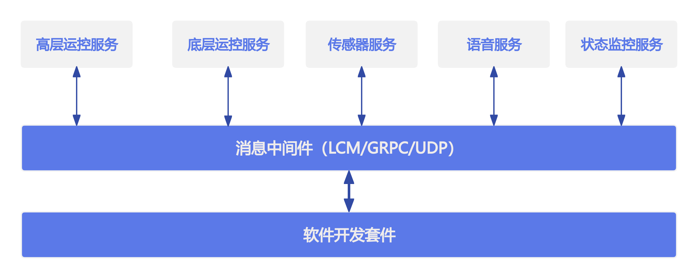

# 服务介绍

Gen1通过消息中间件（LCM/GRPC/UDP）提供如下服务：

- 高层运控服务

基于Gen1内置步态控制器，可进行步态切换、特技执行、控制姿态和速度（等价遥控器）等功能。高层运控服务使用GRPC进行通信。

- 底层运控服务

通过服务接口可实时获取关节、IMU等数据，同事可实时下发关节指令控制电机。底层运控服务使用lcm进行通信。

- 语音服务

通过服务接口可控制音量和语音控制。语音服务使用grpc进行通信。

- 传感器服务

支持lidar、rgbd、三目相机等传感器的数据订阅。传感器服务使用grpc和lcm进行通信。

> Notice: 当前版本仅支持lidar数据订阅，rgbd和三目相机数据暂不支持

- 状态监控服务

通过服务接口可订阅机器人本体软硬件故障和bms状态。状态监控服务使用grpc进行通信。

