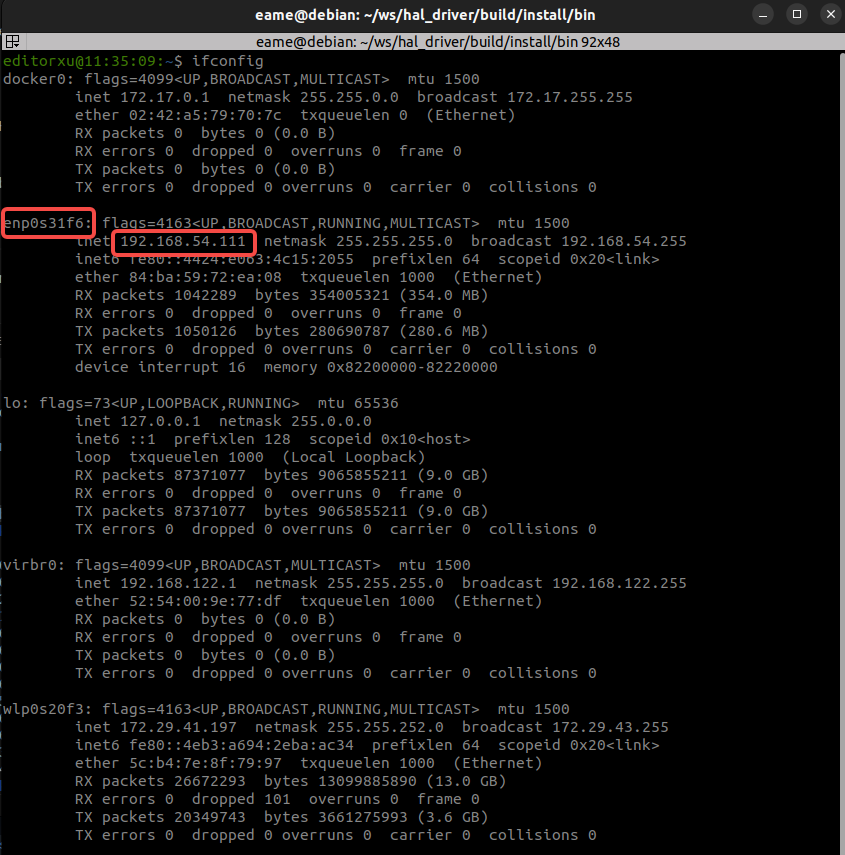

# 快速开始

## 系统环境
推荐在ubuntu22.04系统下开发，暂不支持Mac/Windows系统下开发，机器人本体PC运行官方服务，不支持开发；

### 开发环境要求
- GCC ≥ 11.4 (for Linux)
- CMake ≥ 3.18
- Make build system
- C++20 (minimum)

### 第三方库依赖
```
sudo apt install protobuf-compiler libprotobuf-dev libprotoc-dev libgrpc++-dev libgrpc-dev libfmt-dev libspdlog-dev libcap-dev libacl1-dev liblcm-dev libyaml-cpp-dev libdw-dev libsystemd-dev -y
```

### 系统配置

`/etc/security/limits.conf`文件中增加如下配置：
```
*    -   rtprio   98
```

## 网络环境
将用户计算机与机器人交换机接入统一网络。建议新用户使用网线将用户计算机接入机器人交换机，并将与机器人通信的网卡设置在192.168.54.X网段下，推荐使用192.168.54.111。有经验的用户可自行配置网络环境。


### 配置步骤
1. 用网线的一端连接机器人，另一端连接用户电脑。机器人机载电脑的IP地址为192.168.54.110（小脑算力板）和192.168.54.119（大脑算力板），所以需要将电脑ip设置为同一网段，建议192.168.54.111.


2. 为了测试通信连接是否正常，可以通过ping进行测试：


3. 查看192.168.54.111网址对应的网卡名称，通过`ifconfig`命令查看网卡名字，如图所示：


假设SDK二次开发PC与机器人链接的网口为`enp0s31f6`，需要进行如下配置以便SDK与机器人的底层通信：

```bash
 sudo route add -net 224.0.0.0 netmask 240.0.0.0 dev enp0s31f6
```

## 安装与编译
> 以下步骤假设工作目录为`/home/magicbot/workspace`

### 安装 magicbot-gen1_sdk:
安装步骤：进入magicbot-gen1_sdk目录，并按步骤执行如下命令，将sdk安装至/opt/magic_robotics/magic_gen1_sdk目录下，便于二次开发程序find_package检索编译链接：

```
cd /home/magicbot/workspace/magicbot-gen1_sdk/
mkdir build
cd build
cmake .. -DCMAKE_INSTALL_PREFIX=/opt/magic_robotics/magic_gen1_sdk
make -j8
sudo make install
```

### 例程编译

编译步骤：进入magicbot-gen1_sdk目录，并按步骤执行如下命令，在build目录下生成例程可执行程序：

```
cd /home/magicbot/workspace/magicbot-gen1_sdk/
mkdir build
cd build
cmake ..
make -j8
```

## 例程示例

magicbot-gen1_sdk/build目录中：

- 语音示例:
  - audio_example
- 传感器示例:
  - sensor_example
- 状态监控示例
  - monitor_example
- 底层运控示例
  - low_level_motion_example
- 高层运控示例:
  - recovery_stand_example: -锁定站立
  - balance_stand_example: -平衡站立
  - execute_trick_action_example: -执行特技
  - joy_control_example: -遥控器示例

> Note: 其中，高层运控示例中几种示例有先后依赖顺序（锁定站立->平衡站立->执行特技/遥控器控制）

### 进入调试模式：

按照操作流程，确保机器人进入调试模式

### 运行例程

进入magicbot-gen1_sdk/build目录，执行如下命令：

```
cd /home/magicbot/workspace/magicbot-gen1_sdk/build
# 语音控制示例
./audio_example
```