# 高层运动控制服务

> 提供机器人系统高层运动控制服务，通过HighLevelMotionController可以通过RPC通信方式实现对机器人的步态、特技、遥控的控制。

## 接口定义
`HighLevelMotionController` 是面向语义控制的高层运动控制器，支持如行走、特技、头部运动等控制操作，封装底层细节以供上层系统调用。

### HighLevelMotionController
| 项目 | 内容 |
|------|------|
| 函数名 | HighLevelMotionController |
| 函数声明 | `HighLevelMotionController();` |
| 功能概述 | 构造函数，初始化高层控制器状态。 |
| 备注 | 构造内部控制资源。 |

### ~HighLevelMotionController
| 项目 | 内容 |
|------|------|
| 函数名 | ~HighLevelMotionController |
| 函数声明 | `virtual ~HighLevelMotionController();` |
| 功能概述 | 析构函数，释放控制器资源。 |
| 备注 | 配合 构造函数 使用。 |

### Initialize
| 项目 | 内容 |
|------|------|
| 函数名 | Initialize |
| 函数声明 | `virtual bool Initialize() override;` |
| 功能概述 | 初始化控制器，准备高层控制功能。 |
| 返回值 | `true` 表示成功，`false` 表示失败。 |
| 备注 | 首次使用前必须调用。 |

### Shutdown
| 项目 | 内容 |
|------|------|
| 函数名 | Shutdown |
| 函数声明 | `virtual void Shutdown() override;` |
| 功能概述 | 关闭控制器并释放资源。 |
| 备注 | 配合 Initialize 使用。 |

### SetGait
| 项目 | 内容 |
|------|------|
| 函数名 | SetGait |
| 函数声明 | `Status SetGait(const GaitMode gait_mode);` |
| 功能概述 | 设置机器人步态模式（如锁定站立、平衡站立、拟人行走等）。 |
| 参数说明 | `gait_mode`：步态控制枚举。 |
| 返回值 | `Status::OK` 表示成功，其他为失败。 |
| 备注 | 阻塞接口，可切换多种步态模式。 |

### GetGait
| 项目 | 内容 |
|------|------|
| 函数名 | GetGait |
| 函数声明 | `Status GetGait(GaitMode& gait_mode);` |
| 功能概述 | 获取机器人步态模式（如锁定站立、平衡站立、拟人行走等）。 |
| 参数说明 | `gait_mode`：步态控制枚举。 |
| 返回值 | `Status::OK` 表示成功，其他为失败。 |
| 备注 | 阻塞接口，获取当前步态模式。 |

### ExecuteTrick
| 项目 | 内容 |
|------|------|
| 函数名 | ExecuteTrick |
| 函数声明 | `Status ExecuteTrick(const TrickAction trick_action);` |
| 功能概述 | 执行特技动作（如庆祝、挥手等）。 |
| 参数说明 | `trick_action`：特技动作标识。 |
| 返回值 | `Status::OK` 表示成功，其他为失败。 |
| 备注 | 阻塞接口，需确保机器人当前可执行特技。 |

- 注意事项：特技动作必须要在GaitMode::GAIT_BALANCE_STAND(46)步态下才能进行特技展示

### SendJoyStickCommand
| 项目 | 内容 |
|------|------|
| 函数名 | SendJoyStickCommand |
| 函数声明 | `Status SendJoyStickCommand(const JoystickCommand& joy_command);` |
| 功能概述 | 发送实时摇杆控制指令。 |
| 参数说明 | `joy_command`：包含摇杆坐标的控制数据。 |
| 返回值 | `Status::OK` 表示成功，其他为失败。 |
| 备注 | 非阻塞接口，建议发送频率为 20Hz。 |

## 类型定义

### `JoystickCommand` — 高层运动控制摇杆指令结构体

| 字段名           | 类型    | 描述                                         |
|------------------|---------|----------------------------------------------|
| `left_x_axis`    | `float` | 左侧摇杆的X轴方向值（-1.0：左，1.0：右）     |
| `left_y_axis`    | `float` | 左侧摇杆的Y轴方向值（-1.0：下，1.0：上）     |
| `right_x_axis`   | `float` | 右侧摇杆的X轴方向值（旋转 -1.0：左，1.0：右）|
| `right_y_axis`   | `float` | 右侧摇杆的Y轴方向值（暂未定义用途）          |

---

## 枚举类型定义

### `GaitMode` — 机器人步态模式枚举

| 枚举值                             | 数值 | 描述                     |
|------------------------------------|------|--------------------------|
| `GAIT_RECOVERY_STAND`             | 1    | 站立锁定             |
| `GAIT_CLASSIC_WALK`               | 9    | 经典行走                 |
| `GAIT_HUMANOID_WALK`              | 11   | 拟人行走                 |
| `GAIT_ALL_TERRAIN_WALK`           | 16   | 全地形行走               |
| `GAIT_FAST_WALK`                  | 17   | 高速行走                 |
| `GAIT_BALANCE_STAND`             | 46   | 平衡站立（支持移动） |

---

### `TrickAction` — 特技动作指令枚举

| 枚举值                            | 数值 | 描述                 |
|-----------------------------------|------|----------------------|
| `ACTION_RECOVERY_STAND`           | 103  | 平衡站立         |
| `ACTION_CELEBRATE`                | 201  | 庆祝                 |
| `ACTION_SHAKE_HAND_REACHOUT`      | 217  | 握手 - 伸出          |
| `ACTION_SHAKE_WITH_DRAW`          | 218  | 握手 - 撤回          |
| `ACTION_NOD`                      | 219  | 点头                 |
| `ACTION_SHAKE`                    | 220  | 摇头                 |
| `ACTION_CIRCLE_HEAD`              | 221  | 摇头晃脑             |
| `ACTION_GTEETING`                 | 301  | 打招呼               |
| `ACTION_POINT_GROUND`             | 302  | 指地 - 伸出          |
| `ACTION_POINT_GROUND_WITH_DRAW`   | 303  | 指地 - 撤回          |
| `ACTION_SPREAD_HAND`              | 304  | 张手                 |
| `ACTION_SPREAD_HAND_WITH_DRAW`    | 305  | 张手 - 撤回          |
| `ACTION_TURN_AWAY`                | 306  | 扭身朝后             |
| `ACTION_TURN_BACK`                | 307  | 扭身朝前             |

## 遥控器示意图

1. 左右摇杆x轴和y轴的取值范围为[-1.0, 1.0];
2. 左右摇杆x轴和y轴的方向上/右为正，如示意图所示；

## 高层运动控制机器人状态介绍

机器人的运动包含站立锁定、平衡站立、基础运动、特技动作状态，机器人在运行过程中，通过状态机在不同状态之间进行切换，以实现不同的控制任务。各个状态的解释说明如下：

- 站立锁定：站立锁定是连接机器人挂起落地和平衡站立的状态，机器狗需要进入平衡站立状态后，才能调用相应的运动服务实现机器人的控制。
- 平衡站立：在平衡站立状态下，可调用SDK的各部分接口实现机器人的特技动作和基础运动控制。
- 基础运动：在运动执行过程中，可调用SDK接口，让机器人进入不同的步态。
- 特技动作：当进入特殊动作执行状态后，其他运动控制服务会先被挂起，等待当前动作执行完毕并进入平衡站立状态后再生效。

机器人状态切换机制；

## 高层运动控制接口

机器人的高层运动控制服务可分为基础运动控制和特技动作控制。
- 基础运动控制服务中，可调用相应的接口，根据不同的地形场景和任务需求切换机器人的行走步态。
- 特技动作控制服务中，可调用相应的接口，实现机器人内置的特殊特技，比如庆祝、握手、打招呼等。

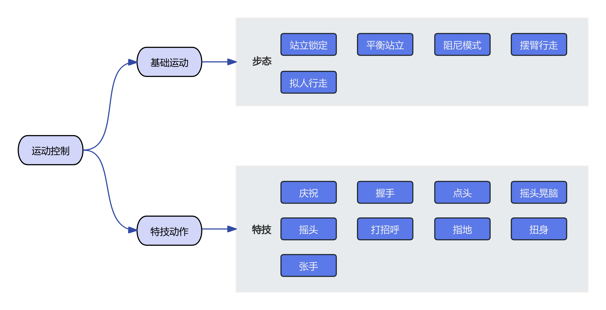

### 步态切换

| 机器人当前步态                            | 步态切换流程 |
|:-----------------------------------:|:------:|
| 被动模式                     |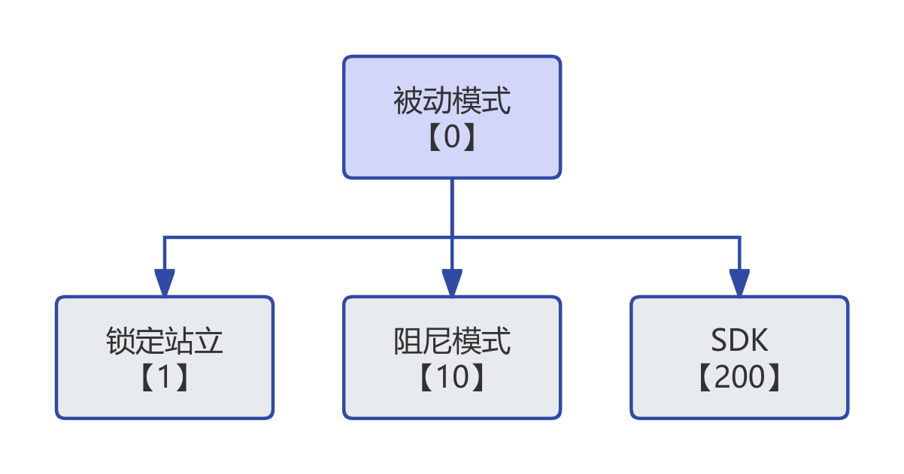     |
| 站立锁定                     |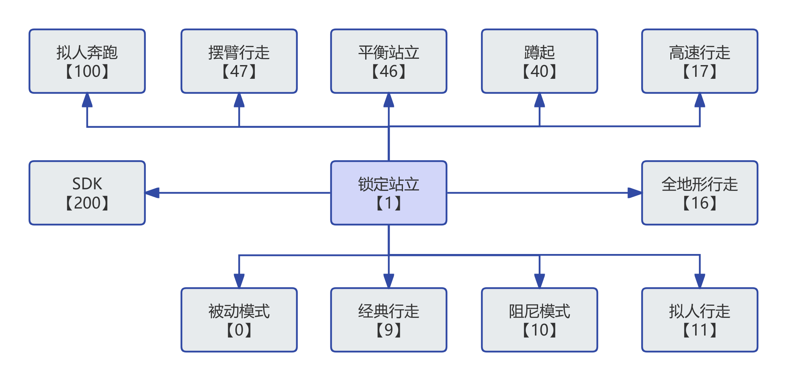     |
| 经典行走                     |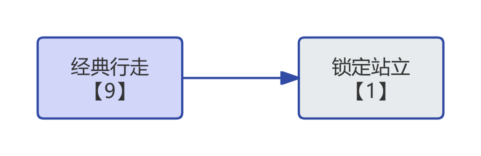     |
| 阻尼模式                     |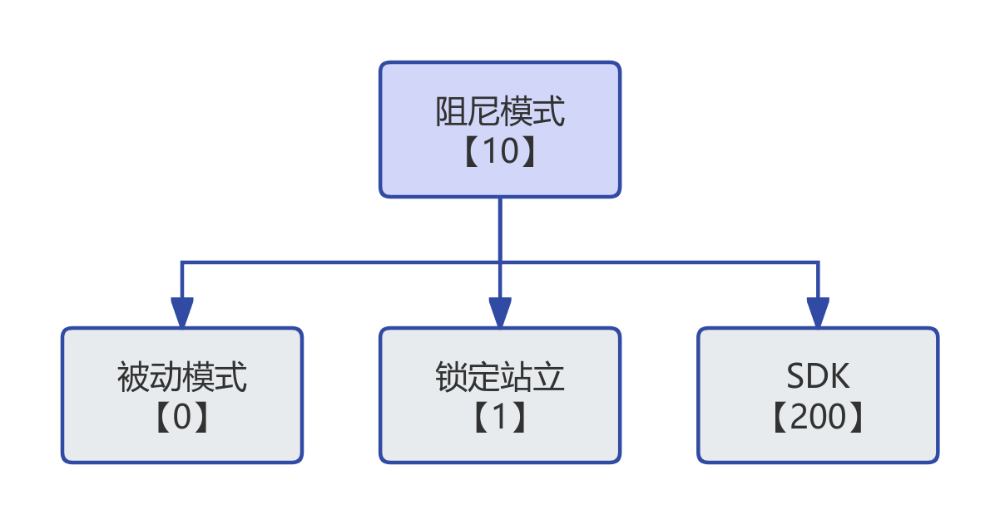     |
| 拟人行走                     |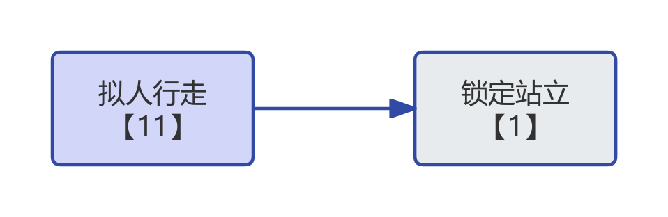     |
| 全地形行走                   |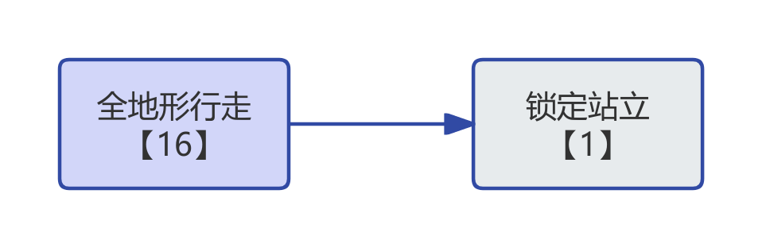     |
| 高速行走                     |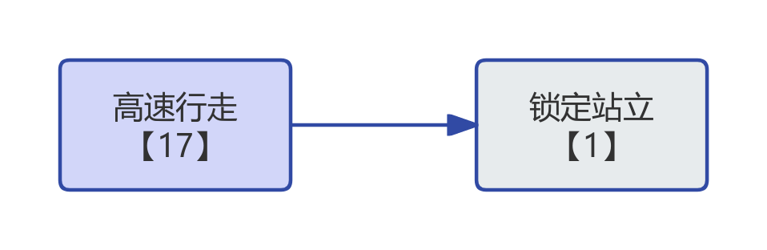     |
| 蹲起                     |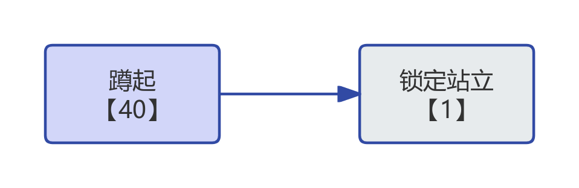     |
| 平衡站立                     |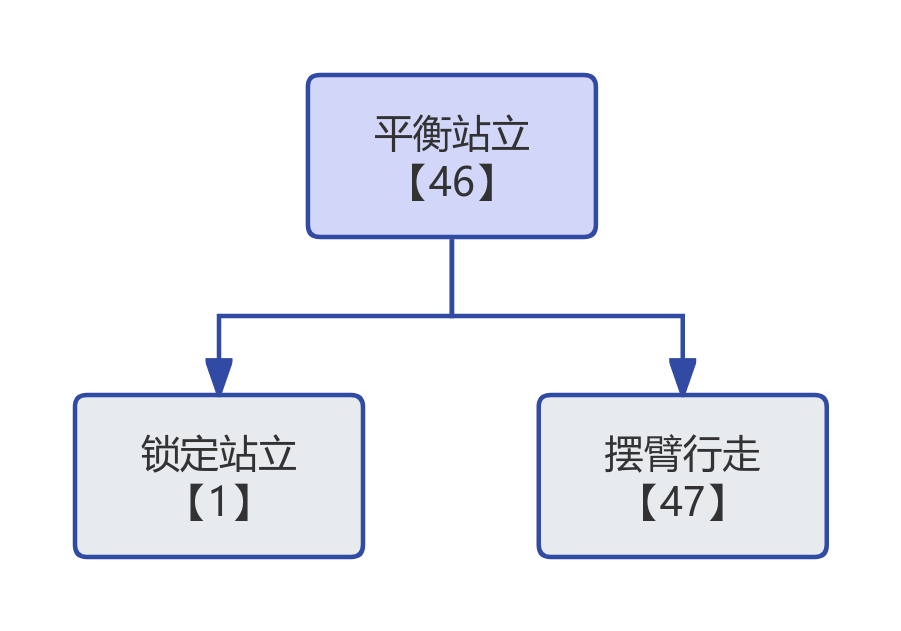     |
| 摆臂行走                     |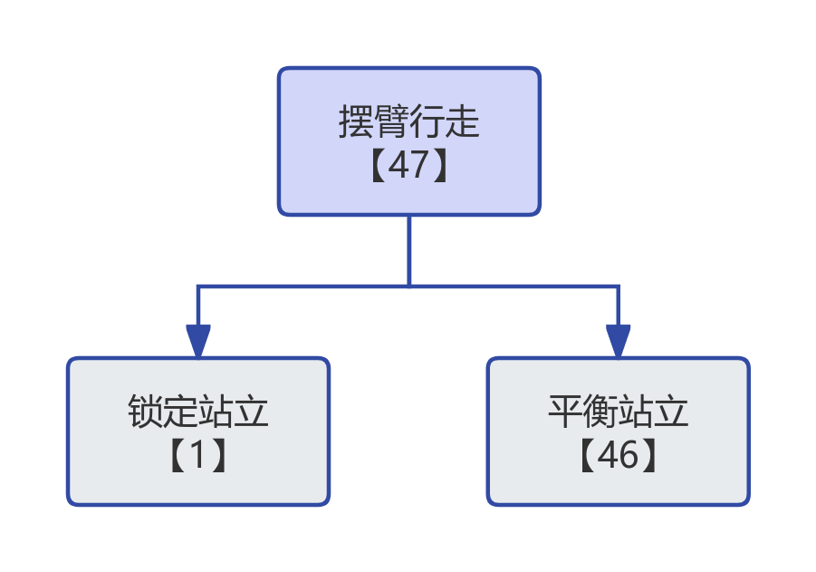     |
| 拟人奔跑                     |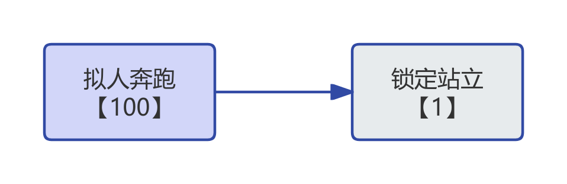     |
| SDK                     |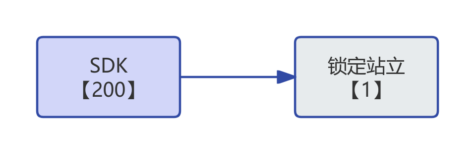     |

### 特技执行

| 机器人特技                            | 特技执行流程 | 示意图                 |
|:-----------------------------------:|:------:|:----------------------:|
| 庆祝                     |     |   \       |
| 握手                     |     |   \       |
| 点头                     |     |     \     |
| 摇头                     |     |   \       |
| 摇头晃脑                  |     |   \       |
| 打招呼                    |     |    \      |
| 指地                     |     |   \       |
| 张手                     |     |    \      |
| 扭身                     |     |      \    |